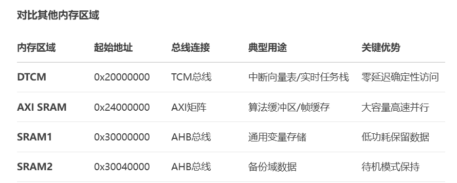
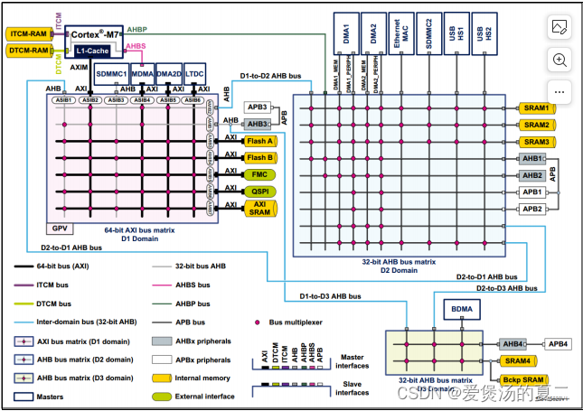
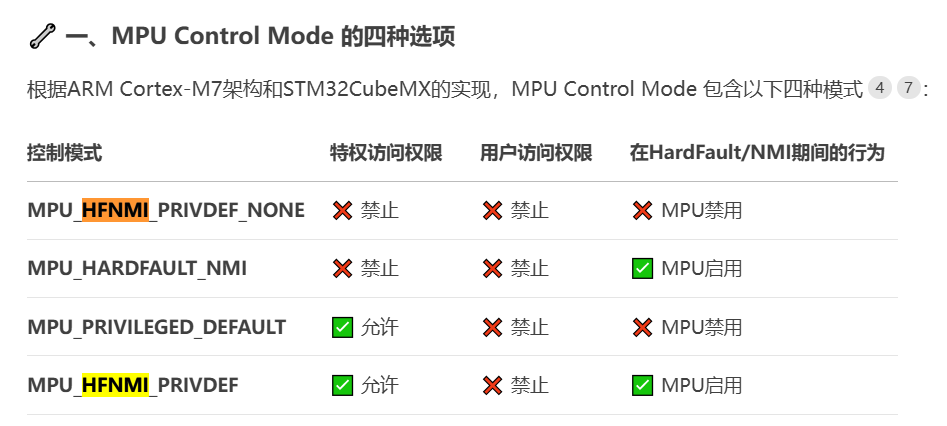
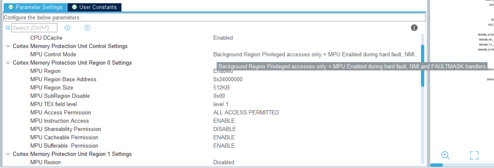
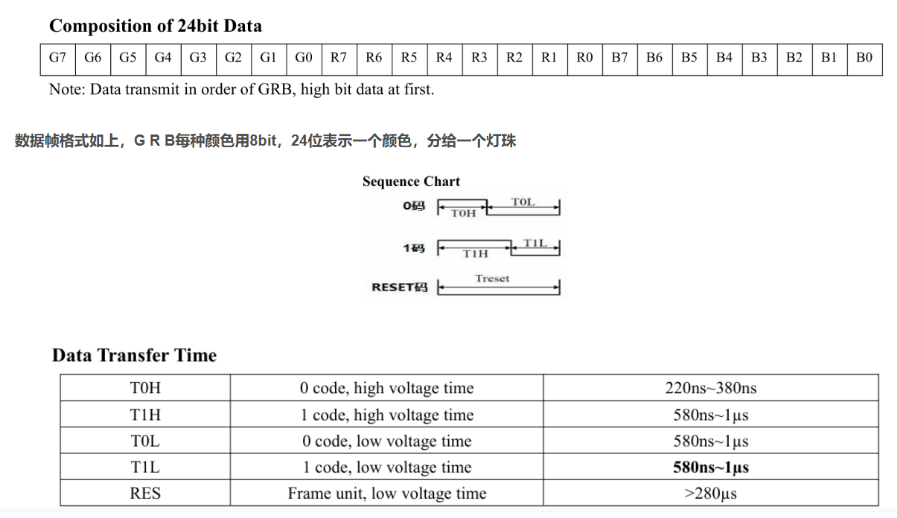
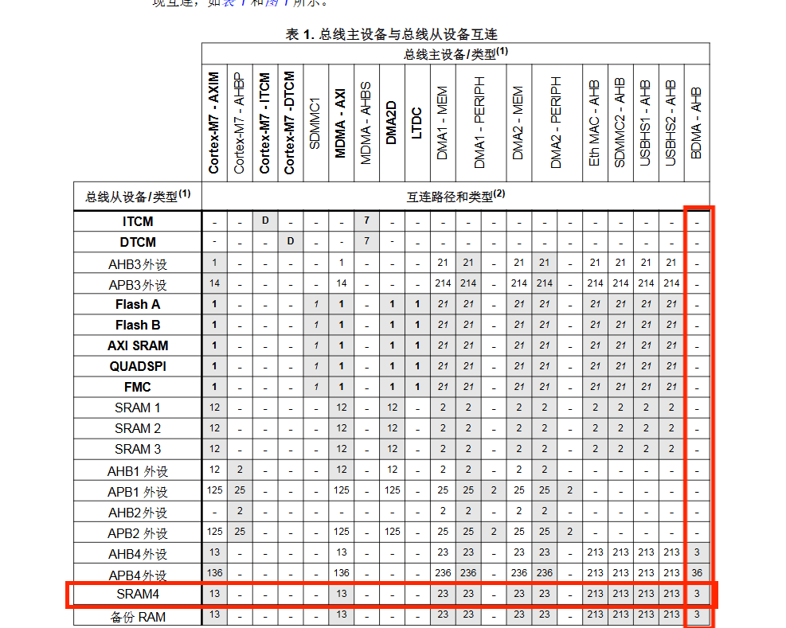

# 开发日志

- 步兵以全向轮步兵为例, 英雄以六子为例

## 要做的事情

- ==开发底层驱动==
  - ==标题开头要改版本号==
  - ==修正外设的逻辑==
  - ~~DMA前后加MPU~~
  - ==开发USB==

- 开发板载设备的BSP

  - ==串口绘图加入USB==
  - ==指示灯ws2812==
  - ==蜂鸣器==
  - ==按键检测==
  - ==电源电压检测与可控电源输出, 两个24V一个5V==
  - IMU
    - ==时间库==
    - ==通信接口加时间戳==
    - ==数据读取==
    - ==通信回调函数规范化, 增加状态变量==
    - ==大结构体传引用==
    - ==阅读手册与寄存器, 分析配置流程==
    - ==矩阵运算库, 向量运算库, 四元数运算库==
    - ==卡方检验==
    - ==温控==
    - 正则化之后状态转移函数重写
    - 量测加速度计和陀螺仪的均值方差
    - vofa+接口开发
  - OSPI与Flash开发
  - ==SPI完善, 加入仅发不收选项==

## 0 杂项

- 电脑编译速度奇慢的话可以打开任务管理器, 关闭MSPCManagerService, 可以大幅提高编译速度

- 复位前记得关闭中断

  ```C
  __set_FAULTMASK(1); // 关闭所有中断
  NVIC_SystemReset(); // 触发系统复位
  ```

- 代码习惯

  - 类的撰写
    - 尽量传引用
    - 不改变成员的函数加const, 比如传参, 函数后const等
    - 带模板的, 初始化函数声明定义, 运算符重载都在类内, get, set函数在h文件内, 其它函数在cpp内

## 1 内存保护

- 稍微了解就行, 不建议加这东西

- 内存分配情况

  

  

- H7特有的

  - 可加快读写速度
  - 缓存, 缓冲, 共享
    - CPU到Cache, 可选缓存 ( 没开缓存则相当于没开Cache提升性能 )
    - CPU到内存, 有Buffer缓冲
    - Cache到内存, 可选Buffer缓冲
    - 总线主机到从机之间, 可选共享 ( 开了共享则相当于没开Cache, 没开共享可能导致数据更新不及时问题 )
  - Cache读写操作
    - 读命中, 直接读Cache就行
    - 读脱靶, 两种策略
      - 读通, 直接读内存不用Cache
      - 读分配, 加载数据到Cache后再读Cache, 性能好一点
    - 写命中, 两种策略
      - 写通, 直接写Cache并写内存, 体现不出优势
      - 写回, 只写Cache, 等数据替换出Cache时同步回内存, 性能好一点
    - 写脱靶, 两种策略
      - 写分配, 加载数据到Cache后再写Cache并写内存, 性能好一点
      - 非写分配, 直接写内存
  - **涉及DMA会引入内存不一致问题**
    - 设置共享属性, 相当于没开Cache
    - 软件维护Cache, 发生在SRAM数据在Cache变化后未更新
      - 操作有点耗时, 不要在中断里
      - DMA搬数据前
        - SCB_CleanDCache_by_Addr将D-Cache里的数据写回到实际存储区SRAM里
      - DMA收到数据后
        - SCB_InvalidateDCache_by_Addr将实际存储区SRAM的数据更新到D-Cache里
  
- CPU的I和DCache开启

- MPU Control Mode选择MPU_HFNMI_PRIVDEF, 高可靠性系统如汽车电子, 需在异常中严格保护内存

  

- 开一块MPU, 对应AXI内存
  
  

## 2 看门狗

- 步兵没有看门狗
- 英雄看门狗频率适中步兵可以参考一下, $32000 \div 4 \div 4096 = 1.95Hz$

## 3 堆栈空间

- 步兵0x200和0x800
- 英雄0x200和0x400 ( 默认 )
- 是否需要适当提高防止后续发生函数嵌套过深的栈溢出问题

## 4 USB

- 可以尝试通过USB设备名进行区分各个机器人

## 5 UART

- UART5, 英雄步兵用的都是9E1
- 以前发现DR16遥控器有概率粘包, 而图传链路也有这个现象. 查看辽科开源电控代码, 发现他们配置是9E2, 经过交流发现这样可以解决丢包问题
- 分析可能的原因: 9E1的配置下, 在物理链路上的停止位还没有结束时, 单片机即认为接收完毕. 而遇到后半段停止位, 单片机以为是新的一轮发送, 因此会触发接收

## 6 LED灯



- 官方例程波特率不太合理, 导致1000ns压着线的, 容易出错
- 修改为6.25Mb/s即可, 即160ns一个bit微元, 1B对应1280ns, 2+6与4+4对应低高电平
- 正常情况下是0xc0和0xf0, 但可能涉及电平稳定问题, 需要将数据右移一位, 与此同时发送完成之后不要急着停, 再发送1字节的0保证RES稳定

- 注意内存访问矩阵, 这个可能是DMA无法正常发送的原因

  > 由于SPI6需要靠BDMA传输, 而BDMA只能访问SRAM4, 即外置SRAM, 因此只能使用阻塞传输

  

## 7 IMU开发

- 特性
  - 有Power On Reset ( POR ) 机制, 上电复位全部数据都清空为初始状态, 因此掉电需要重新配置
  - 加速度计需要先片选一次使能SPI, 而后读一次ACC_CHIP_ID寄存器
  - 此时, 陀螺仪是normal可以直接使用, 而加速度计是suspend, 需要额外配置
    - 上电
    - 1ms
    - 给ACC_PWR_CTRL写入4
    - 50ms
  - 配置完这些才能初步使用
- 我的配置流程
  - 看手册
    - 常规情况下, 可以定时器中断自动读取数据
      - 如果和对应的加速度计或陀螺仪同频, 则可能导致数据未准备好即读取, 主动引入错误时间戳
    - IMU支持两种模式
      - FIFO模式
        - 数据会一股脑存在某个缓冲区内, 某个引脚会给个中断, 而后SPI去读
        - 少次大量, 适合复盘示教
      - 中断模式
        - 数据准备好了, 某个引脚会给个中断, 而后SPI去读
        - 多次小量, 实时性高
        - ==因此采用中断模式==
  - 加速度计, 1600Hz, 625us
    - 开启加速度计电源
    - 将加速度计从默认挂起状态0x03改为工作状态0x00
    - 加速度计无滤波器, 频率1600Hz
    - 加速度计量程±24g
    - 中断1号引脚配置推挽输出模式
    - 配置为如果数据准备好就中断
  - 陀螺仪, 2000Hz, 500us
    - 设置陀螺仪量程2000°/s
    - 设置陀螺仪反馈频率为2000Hz, 带宽为532Hz, 0x80是只读位, 永久为该值, 可忽略
    - 配置为中断输出模式
    - 中断1号引脚配置推挽输出模式, 实际上写0才是配置部分, 默认是全1
    - 配置为如果数据准备好就中断
- 每轮数据请求的状态变化
  - BMI088触发EXTI回调函数指示数据准备完成, 并记录时间戳
    - DR=1
  - 定时器中断回调函数内轮询状态是否满足 " 有中断数据但还没收发 " , 若满足则SPI使能DMA收发. 定时器周期为容忍的数据延迟周期, 由于一轮收发完成约8B, 64b, 对应10Mb/s是6.4us, 因此用10us轮询即可
    - Trans=1, self, DR=0
  - SPI回调函数接收处理, 记录时间戳保证EKF时间确定
    - self, Trans=0, UPDATE=1
  - 计算EKF, 由于工作频率分别是1600和2000Hz, 因此取最小公倍数8000Hz进行计算EKF, 进行朴素地时间戳对齐
    - self, UPDATE=0
  - 闲置, 等待下一轮